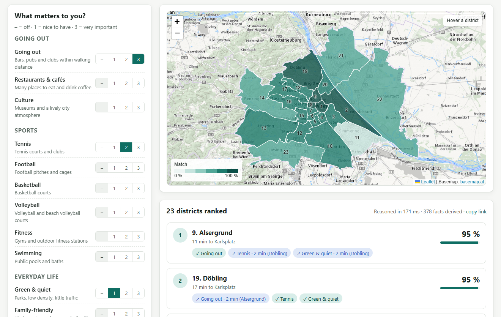
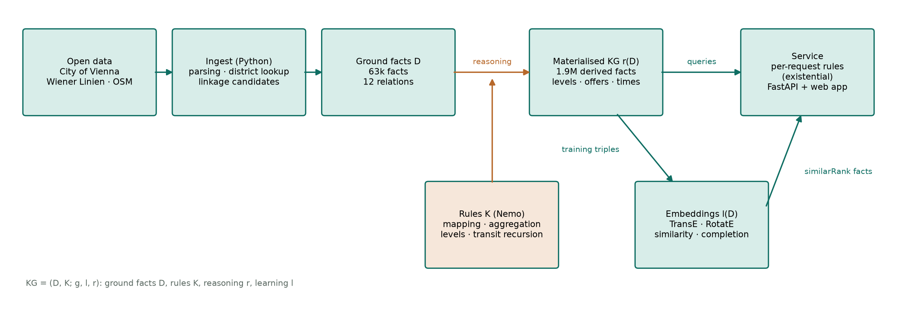
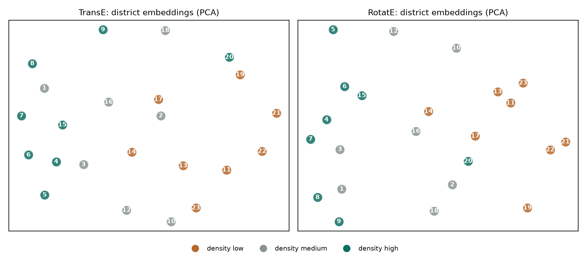

# 1 Scenario

## 1.1 Domain

Every year thousands of students and young professionals move to Vienna and have to pick one of its 23 districts to live in. The districts differ strongly — in nightlife, green space, public transport, sports facilities or demographics — but the information is scattered: the city's statistics office publishes district tables, the city's map service publishes parks, schools or sport facilities, Wiener Linien publishes timetables, and bars or cafés are only found in OpenStreetMap. None of these sources answers the question a newcomer actually has: *which district fits the way I want to live?* This project builds a Knowledge Graph (KG) that integrates these sources and answers this question with logic-based reasoning and knowledge graph embeddings (LO9).

The same kind of location knowledge graph is used in finance (LO10). Banks and insurers score locations for mortgage risk, real-estate valuation or branch planning, and use exactly the indicators my KG integrates — average net income, unemployment rate or transport connectivity per district. As in the company-ownership graphs of the course, the value does not come from a single table but from joining heterogeneous sources and deriving new facts by recursive reasoning: reachability over a transit network is structurally the same problem as control over chains of company shares.

## 1.2 Service

The KG is offered as a web application (LO11). A user rates 15 preferences on a scale from 0 (off) to 3 (very important): *going out*, *restaurants & cafés*, *culture*, six sports (tennis, football, basketball, volleyball, fitness, swimming), *green & quiet*, *family-friendly*, *student life*, *healthcare*, *well connected* and *car-free living*. Optionally, the user sets how many minutes by public transport still count as "nearby", a daily commute destination (any of the 1,757 stations in Vienna) with a maximum travel time, and a district they already like. The service returns all 23 districts ranked by a match score; for every preference it explains whether the district offers it itself, whether it is reachable nearby (via which district, in how many minutes) or whether it is missing, together with the evidence behind it (Figure 1). Two further views show districts similar to a given one (from the embeddings) and a profile of each district in which every fact carries its source and year.

{width=12.5}

# 2 KG Construction

## 2.1 Datasets

The KG combines four open data sources (Table 1). All links are listed in `docs/DATA_SOURCES.md` of the ZIP file; downloads are cached and the OpenStreetMap snapshot is included for reproducibility.

Table 1: Data sources.

| Source | Content used | Size |
|---|---|---|
| City of Vienna statistics (MA 23, MA 20), CC BY 4.0 | 10 district series + car density: population, density, age, income, unemployment, education, households, families, traffic areas, doctors, tourism | 27 indicators, latest complete year 2021–2025 |
| City of Vienna map service (WFS), CC BY 4.0 | parks (with area), schools, kindergartens, universities, markets, museums, sport facilities, playgrounds, district boundaries | 6,173 points, 23 polygons |
| Wiener Linien timetables (GTFS), CC BY 4.0 | stations, lines, stop sequences with times (8.2 M stop times) | 1,757 stations, 7,545 line segments |
| OpenStreetMap (Overpass, snapshot 2026-09-26), ODbL | bars, pubs, clubs, restaurants, cafés, pitches, gyms, pools | 8,554 venues |

Two features from my one-pager are missing: rent and crime rate are not published as open data per district, so the KG cannot rate affordability or safety (see Section 5.1).

## 2.2 Technologies and architecture

Figure 2 shows the architecture (LO5). A Python package ingests the sources, a rule engine derives new knowledge, an embedding library learns latent knowledge, and a FastAPI service with a Leaflet web front end offers both. As reasoner I use **Nemo** 0.10.1 [4], a Datalog engine with existential rules, stratified negation and aggregation whose syntax is close to Vadalog [5]; embeddings are trained with **PyKEEN** 1.11 [3]. The KG is stored as relations (CSV files that Nemo imports as facts); an RDF export is discussed in Section 5.2.

{width=16}

Following the responsibility-driven design from the lecture, everything that interprets data non-trivially — what counts as lively nightlife, what is reachable, which district matches which preference — is written as rules; application code only does I/O, training and presentation. Reasoning runs in two stages: the static part of the KG is materialised once offline (1.89 million derived facts in 17 s), while per request only the preference rules run over the materialised facts (about 400 derived facts in 0.13 s).

## 2.3 Constructing the KG

Loaders turn every source into a small set of ground relations (12 relations, 63,150 facts); all points are assigned to a district by a point-in-polygon test. Schema mapping into the KG vocabulary is written as rules (`10_mapping.rls`), as proposed in the lecture's schema-mapping unit (LO7). Three examples:

1. **Reified observations.** The row `AT13;90700;…;2021;…;27.866` of the net-income table becomes the fact `observation("d07", "net_income", 27866.0, 2021, "income")`: every value keeps its year and source, because the city tables end in different years (2021–2025).
2. **Typed venues.** An OpenStreetMap node tagged `amenity=bar` inside Neubau becomes `poi("osm:node/…", "bar", "d07", "osm")`; the mapping rules and a small venue taxonomy then derive `isA(P, "nightlife_venue")` and `isA(P, "leisure_venue")` (Section 4.1).
3. **Record linkage.** A basketball court appears in the city's sport-facility layer and, 18 m away, as an OpenStreetMap pitch. Python proposes candidate pairs (blocking by sport, matching within 40 m, 2,868 pairs); the rules compute venues as the transitive closure of these matches and pick a representative. 4,782 sport records collapse into 3,003 venues — tennis from 1,040 records to 441 venues, because OpenStreetMap maps single courts while the city lists clubs.

# 3 ML-based Representation

## 3.1 Representation and training

The embedding is trained on the *materialised* KG (LO1): 1,104 triples over 137 entities and 35 relations. Numbers cannot be embedded directly, so each of the 31 district features is represented by the level the rules derived for it (e.g. `d07 has_nightlife_per_km2 nightlife_per_km2:high`, 713 triples); further relations are `adjacent_to` (112), `offers` a preference (124), `within_10_min_of` by public transport (116) and `served_by` a U-Bahn line (39). I trained **TransE** [1] — the lecture's model, scoring a triple by −‖**h** + **r** − **t**‖ — and **RotatE** [2], which models relations as rotations in complex space, with PyKEEN out of the box (64 dimensions, 300 epochs, Adam with learning rate 0.01, 10 negatives per positive, 80/10/10 split, filtered evaluation), each with five random seeds (about 30 s per run on a CPU).

Table 2: Link prediction on the test split (mean ± standard deviation over five seeds) and stability of the district similarity.

| Model | MRR | Hits@1 | Hits@3 | Hits@10 | Seed stability ρ | ρ vs. feature baseline |
|---|---|---|---|---|---|---|
| TransE | 0.371 ± 0.024 | 0.169 | 0.469 | 0.785 | 0.83 | 0.55 |
| RotatE | 0.345 ± 0.022 | 0.161 | 0.416 | 0.780 | 0.91 | 0.57 |

Table 2 reports link prediction (mean ± standard deviation over the seeds), the rank correlation of district similarities between seeds, and their correlation with a baseline that compares the raw feature vectors directly. Five examples show what the representation looks like. All TransE entity vectors have unit norm; the first dimensions of Neubau (`d07`) are (−0.073, 0.034, 0.213, …), of Donaustadt (`d22`) (−0.123, 0.028, 0.000, …), and value, preference and line entities (`nightlife_per_km2:high`, `pref:going_out`, `line:U3`) live in the same space. The translation intuition h + r ≈ t holds: Neubau + `has_nightlife_per_km2` is closest to `high` (distance 1.49, versus 1.62 for medium and 1.75 for low), which is correct; for Donaustadt it is closest to `low` (1.43), also correct. Figure 3 projects the district vectors to two dimensions: without seeing any numbers, both models separate the dense inner districts (1, 4–9, 15) from the green, low-density outer districts (13, 14, 21–23).

{width=15}

District similarity is the cosine similarity of the embeddings, averaged over the five seeds. For Neubau, TransE returns Josefstadt, Rudolfsheim-Fünfhaus and Innere Stadt; for Donaustadt, Leopoldstadt, Floridsdorf and Simmering. The web service uses TransE, the model with the best MRR.

## 3.2 Evolving the KG with the embedding

I used the embedding to complete the KG (LO8). In a completion experiment I hid 20 % of the level facts (143 triples), trained without them and let the model choose between low, medium and high for each. TransE predicted 41 % and RotatE 48 % correctly, against 33 % for random guessing and 21 % for predicting the most frequent level; only 15 % of the predictions confused low with high. A true positive: Josefstadt's share of residents with tertiary education was predicted `high`, which is correct. A false positive: Margareten's density of restaurants and cafés was predicted `low` although it is `high`.

The model also suggests `offers` edges that the rules did not derive. The raw ranking is dominated by `pref:family`, which ten districts already offer — a popularity bias of TransE towards targets with many incoming edges. Taking the best candidate per preference gives plausible suggestions (Landstraße → going out; its nightlife level is medium) and implausible ones (Josefstadt → green & quiet, a dense inner district). I therefore do not add predicted facts to the KG automatically. The embedding changes the KG in one controlled way: its similarity ranks are published as `similarRank` facts, which the per-request rules use as an optional soft preference (Section 5.3).

## 3.3 Context and limitations

KG embeddings are transductive: a new district or a second city would require retraining, whereas graph neural networks could embed unseen nodes (LO6). With only 23 districts the training data is small; similarities vary between seeds (ρ = 0.83 for TransE), which I counter by averaging over five seeds. Discretising numbers into three levels loses information, and the embedding partly rediscovers the feature profile (ρ ≈ 0.55 with the baseline) while adding structure from adjacency and transit links. Scaling to the 250 statistical sub-districts of Vienna would grow the graph linearly and still train in minutes; it would, however, make the relative levels finer and the similarity more useful.

# 4 Logic-based Representation

## 4.1 Rules

The logical knowledge consists of 103 rules and 69 facts in six Nemo programs: schema mapping, aggregation and linkage, levels and preference definitions, public transport, recommendation, and similarity (LO2). Five examples:

**(1) Recursive taxonomy.** Venue categories form a class hierarchy; membership propagates along its transitive closure (bar ⊑ nightlife venue ⊑ leisure venue):

```
subClassOfT(?A, ?C) :- subClassOfT(?A, ?B), subClassOf(?B, ?C).
isA(?P, ?Super) :- isA(?P, ?Class), subClassOfT(?Class, ?Super).
```

**(2) Aggregation and levels.** Features are computed by aggregation and arithmetic; a district's level is its rank among all districts (top third high, bottom third low). Ranks are used instead of thresholds around the mean because the data is very skewed (Innere Stadt has 161,680 tourist overnight stays per 1,000 residents):

```
feature(?D, "nightlife_per_km2", ?X) :- venues(?D, "nightlife_venue", ?N), areaKm2(?D, ?A), ?X = ?N / ?A.
below(?D, ?F, #count(?E)) :- feature(?D, ?F, ?X), feature(?E, ?F, ?Y), ?Y < ?X.
level(?D, ?F, "high") :- rank(?D, ?F, ?R), ?R >= 15.
```

**(3) Preferences as knowledge.** What a preference means is stored as facts, so it can be read, explained and changed without touching code. *Green & quiet*, for instance, requires two of three signals:

```
signal("green_quiet", "park_share", "high").  signal("green_quiet", "population_density", "low").
signal("green_quiet", "road_share", "low").   required("green_quiet", 2).
evidence(?D, ?P, ?F, ?L) :- signal(?P, ?F, ?L), level(?D, ?F, ?L).
signalHits(?D, ?P, #count(?F)) :- evidence(?D, ?P, ?F, ?L).
offers(?D, ?P) :- signalHits(?D, ?P, ?N), required(?P, ?K), ?N >= ?K.
```

**(4) Recursion over the transit network.** From each district's busiest station, journeys are explored recursively over (station, line) states; changing lines costs four minutes and exploration stops at 45 minutes. The minimum over all journeys gives travel times, which feed the features *minutes to the centre* and *within 10 minutes of*:

```
ride(?H, ?Next, ?Line, ?T) :- ride(?H, ?S, ?Line, ?T1), segment(?S, ?Next, ?Line, ?T2, ?Trips),
                              ?T = ?T1 + ?T2, ?T <= 45.
ride(?H, ?Next, ?Line, ?T) :- ride(?H, ?S, ?Prev, ?T1), segment(?S, ?Next, ?Line, ?T2, ?Trips),
                              ?Line != ?Prev, ?T = ?T1 + ?T2 + 4, ?T <= 45.
fastest(?H, ?S, #min(?T)) :- ride(?H, ?S, ?Line, ?T).
```

**(5) Object creation and negation.** Per request, a district is excluded if the commute is not feasible (stratified negation), and every remaining district gets a new *recommendation* node through an existential rule; satisfied preferences, nearby alternatives, scores and explanations attach to that node:

```
excluded(?R, ?D) :- hasCommute(?R), district(?D), ~commuteFeasible(?R, ?D).
candidate(?R, ?D) :- request(?R), district(?D), ~excluded(?R, ?D).
recommendation(!Rec, ?R, ?D) :- candidate(?R, ?D).
satisfiedIn(?Rec, ?P) :- recommendation(?Rec, ?R, ?D), prefers(?R, ?P, ?W), offers(?D, ?P).
```

Because `recommendation` does not depend on itself, new objects are created exactly once per candidate district: the program is weakly acyclic, so reasoning terminates. It is not warded in the Vadalog sense — rules such as the scoring rule join two atoms on the created object — which is unproblematic here because the created objects never enter a recursion. Nemo's derivation traces (`nmo --trace`) explain every derived fact; Appendix A shows how `ride` unfolds along the U1 from Donaustadt to Karlsplatz. To check correctness, I re-implemented three results in plain Python: all 36,639 travel times equal a Dijkstra search with the same transfer rule, all 713 ranks match, and a union-find over the matches gives the same 3,003 venues.

## 4.2 Evolving the KG with rules

The rules mainly complete the KG (LO8): from 63,150 ground facts they derive 1.89 million facts, among them 713 feature levels, 124 `offers` facts, 36,639 travel times and the district hubs. They also clean it: record linkage merges 4,782 sport records into 3,003 venues, and the rule `locationConflict` flags 31 of 6,144 records (0.5 %) whose stated district contradicts their coordinates — in these cases the coordinates are used. When a source publishes a new year, the KG is re-materialised in 17 s; incremental view maintenance is not needed at this size (Nemo does not offer it, which matches the lecture's remark that it is rare in current KG engines).

## 4.3 Context and limitations

Most of the reasoning time goes into the transit recursion (LO6). Without aggregation inside recursion, Datalog enumerates all distinct journey costs instead of only the shortest ones: at one-second resolution the line-aware version exceeded 3.8 GB of memory, so times are rounded to minutes and bounded by 45 minutes, which gives 1.9 million facts in 17 s. Vadalog's monotonic aggregation would compute shortest paths directly. The recursion is linear, the fragment Vadalog evaluates most efficiently. I also hit three limitations of Nemo 0.10.1: it reads one program file (the modular files are concatenated), `#min` over imported strings is not a consistent order (numeric identifiers are used), and a predicate defined by two column-permuted copy rules was joined incompletely (symmetric facts are generated in Python instead). Per-request reasoning only touches the materialised facts and stays at about 0.13 s, independent of the source data size. Scaling to 250 sub-districts would mainly affect the rank computation, which is quadratic per feature (about 2 million comparisons) and still small.

# 5 Reflection

## 5.1 Outcome of the service

The service answers the question from Section 1 (LO11). For the request in Figure 1 it ranks Alsergrund and Döbling first (95 %): Alsergrund offers going out itself and reaches tennis and green areas in Döbling within two minutes, while Döbling is green and offers tennis, with going out two minutes away in Alsergrund. The combination of what a district offers and what is reachable nearby turned out to be the most useful part — pure district-level answers would rank almost only the outer districts for "green" and only the inner ones for "going out". All answers are explainable down to single source records. The main gap for the motivating scenario is affordability: without open rent data the service cannot tell a student which district they can pay for.

## 5.2 Data model

I chose relations (Datalog facts) as the canonical data model, triples for the embeddings, and an RDF export (LO4). The export (`vienna_kg.trig`) puts ground facts (102,979 triples) and derived facts (6,602 triples) into separate named graphs — the extensional and the derived component from the course's KG definition — and keeps year and source on reified observation nodes. A SPARQL query over it ("districts that offer going out within 10 minutes of the centre", result Innere Stadt and Neubau) works on the materialised journeys but could not derive them: property paths compute reachability, not the cost of a path. A property graph would store year and source as edge properties more naturally, and Cypher's variable-length paths could follow the network, but path-cost bounds and per-request object creation are easier to state declaratively in Datalog. The machine-learning view is the most restrictive: everything must become entity–relation–entity, so numbers were turned into levels. The data-science view — a plain feature table — served as the similarity baseline.

## 5.3 Connections between KGs, ML and AI

The two kinds of knowledge are connected in both directions (LO12). Logic feeds ML: the embedding is trained on facts derived by the rules (levels, what districts offer, transit reachability), not on raw data. ML feeds logic: learned similarity enters the rules as `similarRank` facts and can be used as a soft preference ("similar to a district I like"). The experiment showed why the symbolic side should stay in control: embedding suggestions are sometimes plausible and sometimes clearly wrong, and they are biased towards popular targets, whereas every rule-derived fact can be traced and was verified. Conversely, the rules contain hand-set knowledge — which signals define a preference, where the level boundaries lie — that could be learned: rule learning could propose preference definitions, and user feedback could learn the weights. A GNN could make the similarity inductive for new cities. For a newcomer choosing a district, the combination fits: rules give transparent, checkable answers, embeddings add a soft notion of "districts like the one I know".

# References

[1] A. Bordes, N. Usunier, A. García-Durán, J. Weston, O. Yakhnenko: Translating Embeddings for Modeling Multi-relational Data. NIPS 2013.

[2] Z. Sun, Z.-H. Deng, J.-Y. Nie, J. Tang: RotatE: Knowledge Graph Embedding by Relational Rotation in Complex Space. ICLR 2019.

[3] M. Ali et al.: PyKEEN 1.0: A Python Library for Training and Evaluating Knowledge Graph Embeddings. JMLR 22, 2021.

[4] A. Ivliev, L. Gerlach, S. Meusel, J. Steinberg, M. Krötzsch: Nemo: Your Friendly and Versatile Rule Reasoning Toolkit. KR 2024.

[5] L. Bellomarini, E. Sallinger, G. Gottlob: The Vadalog System: Datalog-based Reasoning for Knowledge Graphs. VLDB 2018.

[6] Data: Stadt Wien – data.wien.gv.at (CC BY 4.0); Wiener Linien GTFS (CC BY 4.0); © OpenStreetMap contributors (ODbL).

# Appendix A: Derivation trace

Excerpt of Nemo's derivation trace for the travel time from Donaustadt's hub (Kagraner Platz) to Karlsplatz on the U1 (station identifiers shortened); each line is derived from the one below it by the recursive `ride` rule:

```
ride(Kagraner Platz, Karlsplatz,      U1, 15)  <- ride(…, Stephansplatz, U1, 13) + segment(…, 2)
ride(Kagraner Platz, Stephansplatz,   U1, 13)  <- ride(…, Schwedenplatz, U1, 12) + segment(…, 1)
ride(Kagraner Platz, Schwedenplatz,   U1, 12)  <- ride(…, Nestroyplatz, U1, 11)  + segment(…, 1)
ride(Kagraner Platz, Nestroyplatz,    U1, 11)  <- ride(…, Praterstern, U1, 9)    + segment(…, 2)
ride(Kagraner Platz, Praterstern,     U1, 9)   <- ride(…, Vorgartenstraße, U1, 8) + segment(…, 1)
ride(Kagraner Platz, Vorgartenstraße, U1, 8)   <- ride(…, Donauinsel, U1, 6)     + segment(…, 2)
ride(Kagraner Platz, Donauinsel,      U1, 6)   <- ride(…, Kaisermühlen-VIC, U1, 5) + segment(…, 1)
ride(Kagraner Platz, Kaisermühlen-VIC,U1, 5)   <- ride(…, Alte Donau, U1, 4)     + segment(…, 1)
ride(Kagraner Platz, Alte Donau,      U1, 4)   <- ride(…, Kagran, U1, 2)         + segment(…, 2)
ride(Kagraner Platz, Kagran,          U1, 2)   <- hub(d22, Kagraner Platz)       + segment(…, 2)
```

The full traces, including those for `offers("d07", "going_out")` and `offers("d02", "green_quiet")`, are in `4 - logic/traces.md` of the ZIP file.
